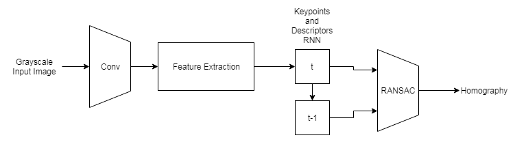
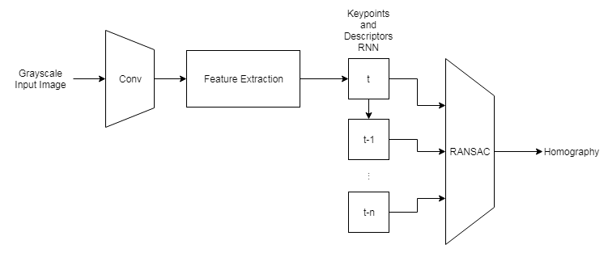

# Video Stabilization
Git repository for our final project in computer vision at UNCC.

# What this does

The leftmost video is our ground truth, the middle is the video after stabilization, and the rightmost is the video after buffered stabilization. As you can see in the middle video, stabilization treats the individual frames as though the camera hasn't moved since the first frame thearby reducing the percieved shakiness of the video. The right video treats the frames as though the camera hasn't moved since a few frames ago, reducing shakiness while still allowing the camera to move.

# How it works
Our algorithm works by extracting the features and finding the homography between the current frame and the previous. This is then used to warp the current frame so as to produce an illusion of the camera not moving. The homography of each frame is multiplied with the previous frame to maintain this illusion throughout the entire video. Our buffered algorithm works in the same way except it only multiplies the last n frames so as to make it seem like the camera hasn't moved in n frames.

# The Future is Neural Networks!
 We've been able to push OpenCV's implementation of SIFT pretty far but utlimately the algorithm is too slow for proper real-time applications. The network [SuperPoint](https://arxiv.org/abs/1712.07629) by Daniel DeTone, Tomasz Malisiewicz, and Andrew Rabinovich seems to run more effieciently with small image sizes but doesn't scale well (at least from our tests) with large images and is meant for feature extraction only. That is why we propose two network architectures that could solve this issue. 
 

 
 The first diagram would take in sequential images (like a video), extract their features, and then using both the features of the current and previous frames estimate a homography. Importantly, this network uses a recurrent network to store information about the previous frame. This would allow the nework to only need to run on a single frame at a time so long as all frames are sequential.
 

 
 The second diagram is the same as the first except that the recurrent network uses the last n frames. This would allow the network to estimate some homography across the last n frames that would warp the frame in a less jagged way causing a stabilizing effect.

# Running
Open in Jupyter Notebook

Documented Notebooks:
* StabilizationCam
* BufferedStabilizationCam

# Dependencies
* Anaconda
* OpenCV
* PyTorch (Recommended)
* Tensorflow (Optional)
* Keras (Optional)

# Further Reading
[SuperPoint](https://arxiv.org/abs/1712.07629)
[SuperPoint-Tensorflow](https://github.com/rpautrat/SuperPoint)
